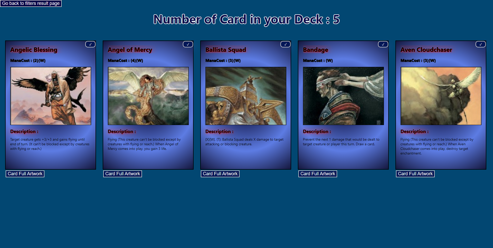

# Projet React - IUT Nantes

## Description

Ce projet a été réalisé dans le cadre de l'unité d'enseignement " Technologie Web côté client".
Il a pour but de nous familiariser avec le framework React.

### Notions utilisés :

-   Router
-   Store
-   API
-   Local Storage
-   React Components & Hooks

## Apercu :

## Installation

### Importer les librairies

### `npm install`

### Lancer le projet

### `npm start`

Open [http://localhost:3000](http://localhost:3000) to view it in your browser.

## Deploiement

### Deployé sur le site Netlify : *https://magic-fan-site.netlify.app*
