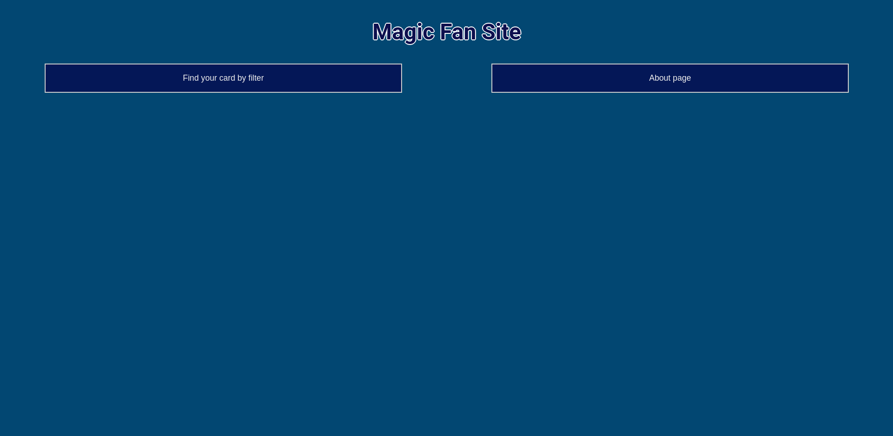

# Projet React - IUT Nantes

## Description

Ce projet a été réalisé dans le cadre de l'unité d'enseignement " Technologie Web côté client".
Il a pour but de nous familiariser avec le framework React.

### Notions utilisés : 
- Router
- Store
- API
- Local Storage
- React Components & Hooks
## Installation 

### Importer les librairies

### `npm install`

### Lancer le projet

### `npm start`

Runs the app in the development mode.\
Open [http://localhost:3000](http://localhost:3000) to view it in your browser.

The page will reload when you make changes.\
You may also see any lint errors in the console.

### build le projet 

### `npm run build`

Builds the app for production to the `build` folder.\
It correctly bundles React in production mode and optimizes the build for the best performance.

The build is minified and the filenames include the hashes.\
Your app is ready to be deployed!

See the section about [deployment](https://facebook.github.io/create-react-app/docs/deployment) for more information.

## Deploiement 

### Deployé sur le site Netlify : *https://magic-fan-site.netlify.app*

